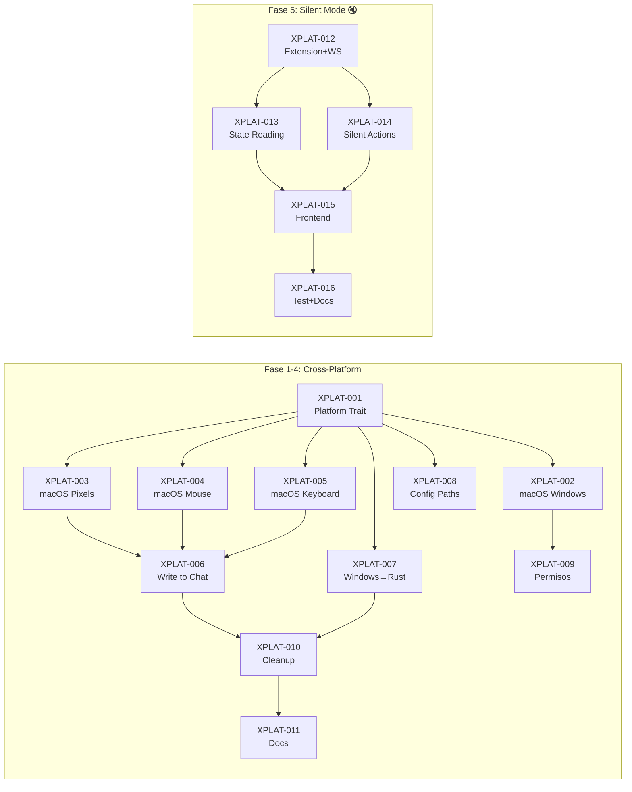

# 🦞 BOB — Plan de Migración Multiplataforma

_Creado: 2026-02-08_

---

## Objetivo

Migrar la capa de automatización UI de PowerShell/Win32 a Rust nativo, habilitando soporte para **Windows y macOS** desde un solo codebase.

---

## Arquitectura Target

```
                    ┌─────────────────────┐
                    │   Frontend (Svelte)  │  ← Sin cambios
                    └──────────┬──────────┘
                               │ invoke()
                    ┌──────────▼──────────┐
                    │   lib.rs (Tauri)     │  ← Llama trait PlatformOps
                    └──────────┬──────────┘
                               │
              ┌────────────────┼────────────────┐
              │                                  │
    ┌─────────▼─────────┐             ┌─────────▼─────────┐
    │ platform_windows.rs│             │ platform_macos.rs  │
    │ (windows crate)    │             │ (core-graphics)    │
    └────────────────────┘             └────────────────────┘
```

### Compilación condicional

```rust
#[cfg(target_os = "windows")]
mod platform_windows;

#[cfg(target_os = "macos")]
mod platform_macos;
```

Rust compila **solo** el módulo del OS actual. Un solo binario por plataforma.

---

## Fases de Implementación

### Fase 1: Foundation (XPLAT-001, XPLAT-002)
**Objetivo**: BOB detecta ventanas en ambos OS

- Crear trait `PlatformOps` con la API unificada
- Implementar `scan_windows()` en macOS usando `CGWindowListCopyWindowInfo`
- Crear wrapper Windows que preserve la funcionalidad PS1 actual
- Modificar `lib.rs` para usar el trait

**Criterio de éxito**: `npm run tauri dev` compila en macOS, botón "Scan" detecta ventanas de VS Code.

---

### Fase 2: Vision (XPLAT-003)
**Objetivo**: BOB puede "ver" el estado de la UI en macOS

- Implementar `capture_region()` en macOS usando `CGWindowListCreateImage`
- Portar la lógica de detección de colores (Accept=azul/verde, Retry=rojo, Chat=gris/rojo)
- Extraer detección de colores a módulo compartido (`color.rs`)

**Criterio de éxito**: "Detect UI" muestra el estado correcto de una ventana de Antigravity en macOS.

---

### Fase 3: Interaction (XPLAT-004, XPLAT-005, XPLAT-006)
**Objetivo**: BOB puede interactuar con la UI en macOS

- Implementar `click_at()` usando `CGEventCreateMouseEvent`
- Implementar `send_keys()` usando `CGEventCreateKeyboardEvent`
- Componer `write_to_chat()` (focus → click input → paste → enter)

**Criterio de éxito**: "Detect & Act" funciona en macOS. Auto-polling completa el flujo.

---

### Fase 4: Consolidation (XPLAT-007, XPLAT-008, XPLAT-009, XPLAT-010, XPLAT-011)
**Objetivo**: Eliminar PowerShell, pulir, documentar

- Migrar Windows de PS1 a Rust nativo (windows crate)
- Hacer configurable el path base de proyectos
- Agregar entitlements macOS en Info.plist
- Limpiar código muerto
- Actualizar documentación

**Criterio de éxito**: Zero scripts PowerShell. Build funcional en ambos OS. DEPLOY.md actualizado.

---

### Fase 5: Silent Mode 🔇 (XPLAT-012, XPLAT-013, XPLAT-014, XPLAT-015, XPLAT-016)
**Objetivo**: BOB opera 100% en background, sin robar foco

> ⚡ **Esta fase es independiente de las Fases 1-4.** Puede empezarse inmediatamente con el BOB actual en Windows.

- Crear extensión companion "BOB Helper" para Antigravity/VS Code
- Comunicación BOB ↔ Extension via WebSocket localhost
- Lectura de estado via `when` contexts de Antigravity (sin screenshots)
- Acciones via `vscode.commands.executeCommand()` (sin SetForegroundWindow)
- Fallback automático a modo legacy si extensión no está instalada

**Comandos Antigravity descubiertos:**
- `antigravity.command.accept` — Aceptar cambios de archivo
- `antigravity.agent.acceptAgentStep` — Aceptar paso del agente
- `antigravity.terminalCommand.accept` — Aceptar comando terminal
- `antigravity.prioritized.chat.open` — Abrir chat

**Criterio de éxito**: BOB completa un ciclo completo (detect → accept → send prompt) sin que ninguna ventana cambie de foco.

---

## Dependencias entre Issues



---

## Risks

| Riesgo | Probabilidad | Impacto | Mitigación |
|--------|:---:|:---:|------------|
| Permisos macOS denegados por usuario | Media | Alto | Mostrar instrucciones claras en la UI |
| Colores de Antigravity cambian con update | Media | Alto | Extraer colores a config → **eliminado con Fase 5** |
| Retina (2x) altera coordenadas de pixel | Alta | Medio | Usar logical coordinates → **eliminado con Fase 5** |
| CGWindowListCreateImage requiere Screen Recording | Seguro | Alto | Documentar en onboarding → **eliminado con Fase 5** |
| Antigravity actualiza y cambia comandos internos | Baja | Alto | Versionar extensión, notificar si comando falla |
| `sendPrompt` no tiene comando directo | Media | Medio | Usar Chat Participant API o simular via extension |
| WebSocket puerto ocupado | Baja | Bajo | Puerto configurable, auto-retry con puerto +1 |

---

_Última actualización: 2026-02-08_
